# Diagrama de clases — ReviewLab

Arquitectura MVVM: cada pantalla con estado expone un `ViewModel` que publica
un `UiState` inmutable mediante `MutableStateFlow`. Las pantallas observan
ese estado con `collectAsState()` y nunca lo modifican directamente.

```mermaid
classDiagram
    class ViewModel {
        <<androidx.lifecycle>>
    }

    class LoginViewModel {
        -MutableStateFlow~LoginState~ _uiState
        +StateFlow~LoginState~ uiState
        +updateEmail(value String)
        +updatePassword(value String)
        +togglePasswordVisibility()
        +loginButtonPress()
        +onNavigated()
    }
    class LoginState {
        +String email
        +String password
        +Boolean showPassword
        +String errorMessage
        +Boolean showError
        +Boolean navigate
    }

    class RegisterViewModel {
        -MutableStateFlow~RegisterState~ _uiState
        +StateFlow~RegisterState~ uiState
        +updateEmail(value String)
        +updateCellphone(value String)
        +updatePassword(value String)
        +togglePasswordVisibility()
        +registerButtonPress()
        +onNavigated()
    }
    class RegisterState {
        +String email
        +String cellphone
        +String password
        +Boolean showPassword
        +String errorMessage
        +Boolean showError
        +Boolean navigate
    }

    class HomeViewModel {
        -MutableStateFlow~HomeState~ _uiState
        +StateFlow~HomeState~ uiState
        +updateCategoria(categoria String)
    }
    class HomeState {
        +String categoriaSeleccionada
        +List~Product~ productos
    }

    class SearchViewModel {
        -MutableStateFlow~SearchState~ _uiState
        +StateFlow~SearchState~ uiState
        +updateQuery(value String)
    }
    class SearchState {
        +String query
        +List~Product~ resultados
    }

    class NotificationsViewModel {
        -MutableStateFlow~NotificationsState~ _uiState
        +StateFlow~NotificationsState~ uiState
        +marcarTodasLeidas()
    }
    class NotificationsState {
        +Boolean leidas
        +List~NotificationItem~ notificaciones
    }

    class NewReviewViewModel {
        -MutableStateFlow~NewReviewState~ _uiState
        +StateFlow~NewReviewState~ uiState
        +updatePuntuacion(value Int)
        +updateTitulo(value String)
        +updateResena(value String)
        +updateUsuario(value String)
        +updateCorreo(value String)
        +publicarButtonPress()
        +onPublicado()
    }
    class NewReviewState {
        +Int puntuacion
        +String titulo
        +String resena
        +String usuario
        +String correo
        +Boolean publicado
    }

    class ReviewsListViewModel {
        -MutableStateFlow~ReviewsListState~ _uiState
        +StateFlow~ReviewsListState~ uiState
        +init(productId String)
        +updateOrden(orden OrdenResenas)
        +updateConFotos(conFotos Boolean)
        +cargarMas()
    }
    class ReviewsListState {
        +String productId
        +Product producto
        +List~Review~ todasLasResenas
        +List~Review~ resenasFiltradas
        +OrdenResenas orden
        +Boolean conFotos
        +Int cantidadVisible
    }

    class Product {
        +String id
        +String name
        +String category
        +Double rating
        +Int reviewCount
        +Int recommendPercent
        +List~Pair~ ratingBreakdown
    }
    class Review {
        +String id
        +String productId
        +String author
        +Boolean verifiedBuyer
        +Int rating
        +String title
        +String body
        +String date
        +Int usefulCount
        +Boolean recommended
        +Boolean hasPhoto
        +ReviewStatus status
    }
    class User {
        +String name
        +String initials
        +Int memberSinceYear
        +Int reviewCount
        +Int usefulVotes
        +Double averageRating
    }
    class NotificationItem {
        +String id
        +ImageVector icon
        +Boolean highlighted
        +String message
        +String time
    }

    class LocalProductProvider {
        <<object>>
        +trending() List~Product~
        +search(query String) List~Product~
        +findById(id String) Product
    }
    class LocalReviewProvider {
        <<object>>
        +forProduct(productId String) List~Review~
        +byUser(author String) List~Review~
        +featuredForProduct(productId String) List~Review~
    }
    class LocalUserProvider {
        <<object>>
        +currentUser User
    }
    class LocalNotificationProvider {
        <<object>>
        +notifications List~NotificationItem~
    }

    ViewModel <|-- LoginViewModel
    ViewModel <|-- RegisterViewModel
    ViewModel <|-- HomeViewModel
    ViewModel <|-- SearchViewModel
    ViewModel <|-- NotificationsViewModel
    ViewModel <|-- NewReviewViewModel
    ViewModel <|-- ReviewsListViewModel

    LoginViewModel --> LoginState : emite
    RegisterViewModel --> RegisterState : emite
    HomeViewModel --> HomeState : emite
    SearchViewModel --> SearchState : emite
    NotificationsViewModel --> NotificationsState : emite
    NewReviewViewModel --> NewReviewState : emite
    ReviewsListViewModel --> ReviewsListState : emite

    HomeState --> Product
    SearchViewModel --> LocalProductProvider
    HomeViewModel --> LocalProductProvider
    ReviewsListViewModel --> LocalProductProvider
    ReviewsListViewModel --> LocalReviewProvider
    ReviewsListState --> Product
    ReviewsListState --> Review
    NotificationsViewModel --> LocalNotificationProvider
    NotificationsState --> NotificationItem
    Review --> User : author
```

