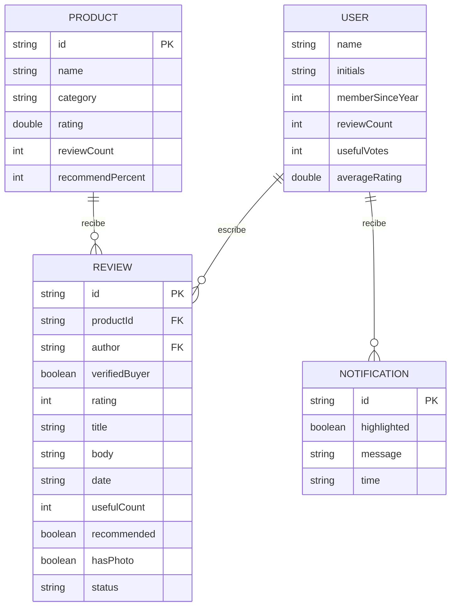

# Diagrama entidad-relación — ReviewLab

ReviewLab actualmente usa datos locales en memoria (`data/Local*Provider.kt`)
en lugar de una base de datos, pero el modelo de entidades ya está definido
y listo para mapearse a una base de datos (por ejemplo Room/SQLite) en un
sprint futuro.

## Notas

- `REVIEW.productId` referencia a `PRODUCT.id`.
- `REVIEW.author` referencia al nombre de `USER` (hoy solo existe un usuario
  local, `LocalUserProvider.currentUser`).
- `NOTIFICATION` no está asociada a un usuario específico todavía; en la app
  actual todas las notificaciones son globales para la sesión activa.
